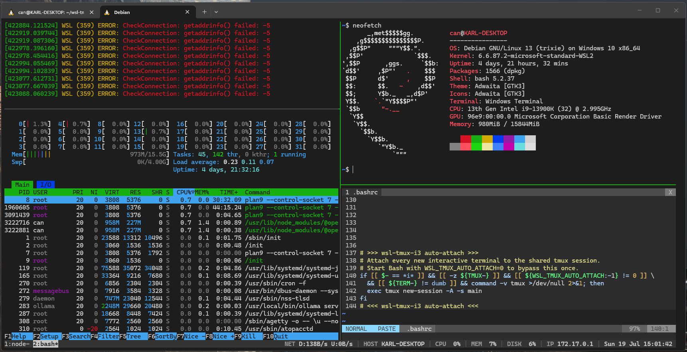

# WSL tmux i3 key bindings

Use tmux in WSL with i3-inspired, prefix-free `Alt` shortcuts. The installer does not overwrite an existing `~/.tmux.conf`; it adds a managed block and updates that block on subsequent runs.



## Installation

```bash
git clone https://github.com/CNuhlar/wsl-tmux-i3-bindings.git
cd wsl-tmux-i3-bindings
./install.sh
tmux new -A -s main
```

Run `./install.sh --dry-run` to preview the changes. Use `--no-packages` to skip package installation or `--no-terminal` to leave Windows Terminal unchanged.
By default, the installer also adds a managed block to `~/.bashrc`. Every new interactive Bash terminal automatically attaches to the shared `main` tmux session. Use `--no-auto-attach` if you do not want this behavior.

`curl | bash` only downloads one file and therefore cannot see the helper files in this repository. If you want a pipe-based install, use this pattern to unpack the repository into a temporary directory:

```bash
tmp="$(mktemp -d)" && \
curl -fsSL https://github.com/CNuhlar/wsl-tmux-i3-bindings/archive/refs/heads/main.tar.gz | tar -xz -C "$tmp" --strip-components=1 && \
bash "$tmp/install.sh" && rm -rf "$tmp"
```

## Key bindings

| Key | Action |
|---|---|
| `Alt+h` / `Alt+v` | Select horizontal / vertical split direction for the current window |
| `Alt+Enter` | Open a terminal pane in the selected direction |
| `Alt+n` | Create a new tmux window (workspace) |
| `Alt+arrow keys` | Focus left/down/up/right pane |
| `Alt+j/k/l` | Focus down/up/right pane |
| `Alt+r` | Enter resize mode |
| Arrows or `h/j/k/l` in resize mode | Resize the active pane by 5 cells |
| `Esc` or `q` in resize mode | Leave resize mode |
| `Alt+Shift+h/j/k/l` | Resize directly without entering resize mode |
| `Alt+1..9` | Switch to a numbered window, creating it if missing |
| `Alt+Shift+arrow keys` | Move the active pane left/down/up/right by swapping it with its neighbour |
| `Alt+Shift+1..9` | Move the active pane to a numbered window, creating it if missing; it is placed using that window's split direction |
| `Alt+f` | Toggle pane zoom |
| `Alt+Space` | Select the next layout |
| `Alt+q` | Display pane numbers |
| `Alt+Shift+q` | Kill the active pane immediately |
| `Ctrl+Space`, then `|` / `-` | Prefix-based split fallback |

## Automatic session attachment

Opening a new WSL terminal runs the equivalent of:

```bash
tmux new-session -A -s main
```

All Windows Terminal tabs therefore display the same tmux session. The `.bashrc` guard only runs in interactive shells and skips attachment when already inside tmux, preventing nested sessions.

To bypass auto-attach for one terminal, launch Bash with the environment switch disabled:

```bash
WSL_TMUX_AUTO_ATTACH=0 bash
```

To disable it permanently, re-run installation with `--no-auto-attach` after removing the managed auto-attach block, or run `./install.sh --uninstall` and reinstall with that option. The uninstall command removes the managed `.bashrc` block without touching other shell settings.

Windows Terminal may capture `Alt+Enter`, `Alt+Space`, and some `Alt+number` combinations. The installer marks these combinations as `unbound`, allowing them to reach tmux. The original file is preserved as `settings.json.wsl-tmux-i3.bak` on the first run. WSL's `/etc/wsl.conf` is not changed because it does not manage keyboard shortcuts.

The split workflow follows i3: press `Alt+h` or `Alt+v` to choose where the next terminal should go, then press `Alt+Enter` to create it. The selected direction remains active until you change it.
Direction selection is silent; the active pane is identified by its green border.

Press `Alt+r` to enter resize mode. A `RESIZE` indicator appears in the status bar. Use either the arrow keys or `h/j/k/l` repeatedly, then press `Esc` to return to normal mode.

Copy mode uses vi keys. Press `Ctrl+Space`, then `[`, start a selection with `v`, and copy it to the Windows clipboard (`clip.exe`) with `y`. `Ctrl+a` remains available to Bash/readline and moves the cursor to the beginning of the command line.

## Status bar

The bottom bar is similar to i3status and refreshes every second. Network download/upload rates appear first, followed by hostname, CPU usage, memory usage, root disk usage, battery when WSL exposes one, IP address, and the current date and time with seconds. The tmux session name is intentionally hidden. It also displays a highlighted `RESIZE` indicator while resize mode is active.

The installer refreshes `status.conf` with the latest defaults on every run. Put personal overrides and custom commands in `status.local.conf`; the installer never overwrites it:

```bash
nano ~/.config/wsl-tmux-i3/status.local.conf
tmux refresh-client -S
```

Available switches and formats are:

```bash
STATUS_SHOW_HOST=1
STATUS_SHOW_CPU=1
STATUS_SHOW_MEMORY=1
STATUS_SHOW_LOAD=0
STATUS_SHOW_DISK=1
STATUS_SHOW_IP=1
STATUS_SHOW_NETWORK=1
STATUS_SHOW_BATTERY=1
STATUS_DISK_PATH="/"
STATUS_DATE_FORMAT="%a %d %b"
STATUS_TIME_FORMAT="%H:%M:%S"
```

Use `1` to enable a segment and `0` to disable it. `STATUS_DISK_PATH` selects the filesystem measured by the disk segment. Date formats use the standard `date` command syntax.

Values that change width frequently use compact, right-aligned fields so CPU percentages and network rates do not move the rest of the bar. Static values such as host, IP, date, and custom output use their natural width. Override widths in `status.local.conf` when needed:

```bash
STATUS_WIDTH_HOST=0
STATUS_WIDTH_CPU=3
STATUS_WIDTH_MEMORY=3
STATUS_WIDTH_LOAD=5
STATUS_WIDTH_DISK=3
STATUS_WIDTH_IP=0
STATUS_WIDTH_NETWORK=0
STATUS_WIDTH_BATTERY=3
STATUS_WIDTH_DATE=0
STATUS_WIDTH_CUSTOM=0
```

Positive widths are right-aligned and shorter values are padded on the left. Longer values are never truncated, so `100%` remains intact even though percentage fields are optimized for two-digit values. A width of `0` uses the value's natural width. `STATUS_WIDTH_CUSTOM` applies to every custom command segment.

### Custom segments

Append entries to `CUSTOM_SEGMENTS` using `LABEL::COMMAND`. The command output is displayed after the label (embedded newlines are collapsed):

```bash
CUSTOM_SEGMENTS+=("DOCKER::docker ps -q 2>/dev/null | wc -l")
CUSTOM_SEGMENTS+=("K8S::kubectl config current-context 2>/dev/null")
CUSTOM_SEGMENTS+=("GIT::git -C ~/project branch --show-current 2>/dev/null")
```

Commands run with Bash and have a two-second timeout so a slow command cannot permanently block the bar. Keep commands lightweight because they run every second. The config is executable shell syntax; only add commands you trust. To change the refresh rate, set `status-interval` in `~/.tmux.conf` after the managed block, for example:

```tmux
set -g status-interval 10
```

Re-running the installer updates both `status.sh` and the default `status.conf`, then loads your preserved `status.local.conf` overrides last. To see the rendered output while debugging a segment, run:

```bash
~/.config/wsl-tmux-i3/status.sh
```

## Uninstall

```bash
./install.sh --uninstall
```

This removes only the managed tmux block and restores the Windows Terminal backup. Use `./install.sh --uninstall --no-terminal` if you do not want to restore Terminal settings.
The managed `status.sh` and default `status.conf` are removed. Your personal `status.local.conf` is preserved.

## Troubleshooting

- Run `tmux source-file ~/.tmux.conf` if settings do not reload immediately.
- If `Alt` keys do not reach the shell, verify that you use Windows Terminal and that installation completed without an error.
- Other terminal emulators require their own `Alt`/Meta shortcut configuration.

The official Windows Terminal documentation recommends `unbound` keybindings to pass a key through to the terminal application: https://learn.microsoft.com/windows/terminal/customize-settings/actions#unbind-keys-disable-keybindings
